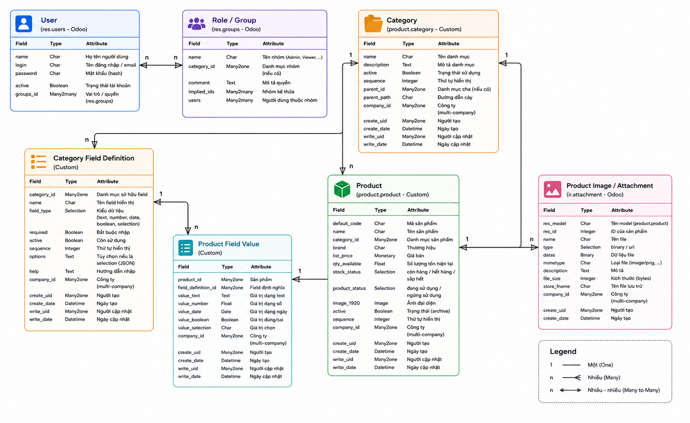

# Data Model

| Thuộc tính | Giá trị |
|---|---|
| Dự án | Product Management PV |
| Ứng dụng | Quản lý sản phẩm nội bộ |
| Nguồn đầu vào | `detailed_technical_design.md` |
| Phiên bản tài liệu | Draft 1 |
| Ngày lập | 2026-08-06 |

## 1. Overview

| Entity | Mục đích |
|---|---|
| User | Lưu tài khoản người dùng nội bộ. |
| Role / Group | Xác định quyền của người dùng. |
| Product | Lưu thông tin chung của sản phẩm. |
| Category | Danh mục sản phẩm. |
| Category Field Definition | Định nghĩa các field riêng theo từng danh mục. |
| Product Field Value | Lưu giá trị của các field riêng trên từng sản phẩm. |
| Product Image / Attachment | Lưu hình ảnh hoặc tệp liên quan đến sản phẩm. |

## 2. Entity Relationship Diagram

- Nhiều `user` thuộc một `group`
- Một `category` có nhiều `product` và có nhiều `Category Field Defination`
- Nhiều `product` thuộc về một `category`, có nhiều `product field value` và có nhiều `product image/attachment` và có nhiều `attachment`

**Group**: Tái sử dụng cơ chế group của Odoo

| Field | Mô tả | 
|---|---|
| Admin | Quản lý sản phẩm, danh mục, tài khoản người dùng |
| Viewer | Chỉ xem, tìm kiếm, lọc, so sánh sản phẩm |

**User**: Tái sử dụng model người dùng có sẵn

| Field | Mô tả |
|---|---|
| Name | Họ tên |
| Username | tên đăng nhập |
| password | mật khẩu |
| active | trạng thái |
| groups | quyền |

**Category**: Đại diện cho nhóm phân loại sản phẩm

| Field | Mô tả |
|---|---|
| Name | Tên danh mục |
| Descriptoin | Mô tả |
| active | trạng thái |

**Category Field Definition**: Đại diện cho định nghĩa các filed trong 1 danh mục

| Field | Ý nghĩa |
|---|---|
| Category | Danh mục sở hữu field này. |
| Field Name | Tên field hiển thị cho người dùng. |
| Field Type | Kiểu dữ liệu: text, number, date, boolean, selection. |
| Required | Field có bắt buộc nhập hay không. |
| Active | Field còn sử dụng hay không. |
| Sequence | Thứ tự hiển thị. |

**Product**: đại diên cho sản phẩm trong hệ thống

| Field | Ý nghĩa |
|---|---|
| Product Code | Mã sản phẩm. |
| Name | Tên sản phẩm. |
| Category | Danh mục sản phẩm. |
| Brand | Thương hiệu. |
| Sale Price | Giá bán. |
| Purpose | Công dụng hoặc nhu cầu khách hàng mà sản phẩm phù hợp. |
| Quantity On Hand | Số lượng tồn hiện tại. |
| Stock Status | Trạng thái tồn kho: còn hàng, hết hàng, sắp hết. |
| Product Status | Trạng thái sản phẩm: đang sử dụng, ngừng sử dụng. |
| Main Image | Ảnh đại diện sản phẩm. |
| Active | Dùng cho archive/ngừng sử dụng nếu theo chuẩn Odoo. |
 
**Product Field Value**: lưu giá trị thực tế của các field

| Field | Ý nghĩa |
|---|---|
| Product | Sản phẩm sở hữu giá trị này. |
| Field Definition | Field được định nghĩa bởi danh mục. |
| Value Text | Giá trị dạng text. |
| Value Number | Giá trị dạng số. |
| Value Date | Giá trị dạng ngày. |
| Value Boolean | Giá trị đúng/sai. |
| Value Selection | Giá trị chọn từ danh sách. |

**Prouct Image/Attachment**: tận dung cơ chế attachment/image của Odoo

| Field | Ý nghĩa |
|---|---|
| Product | Sản phẩm liên quan. |
| File | Ảnh hoặc tệp đính kèm. |
| Type | Loại file. |
| Description | Mô tả nếu cần. |
