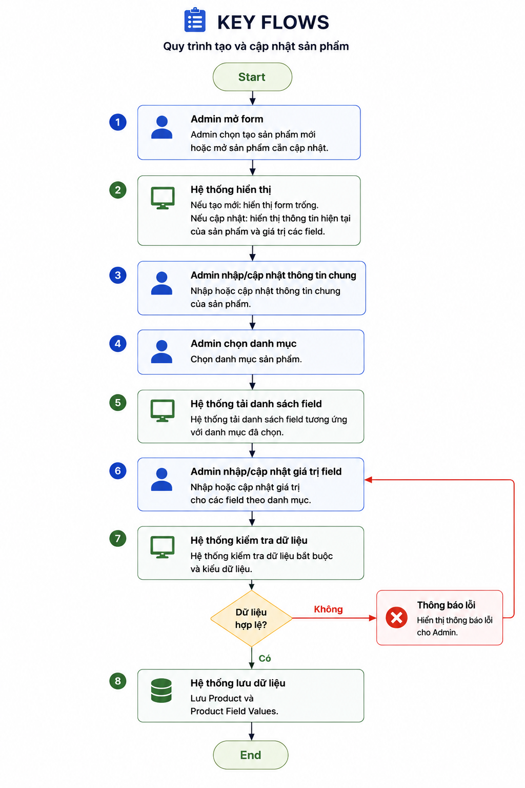
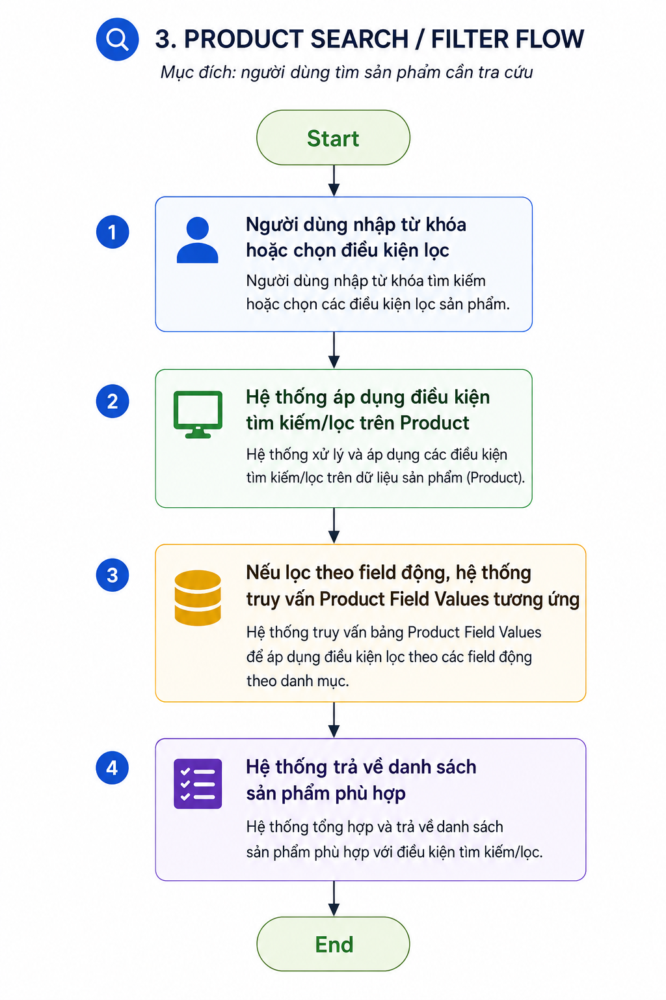
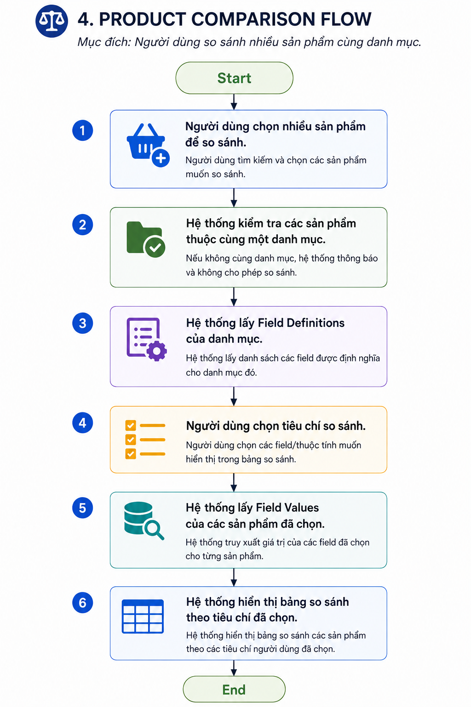
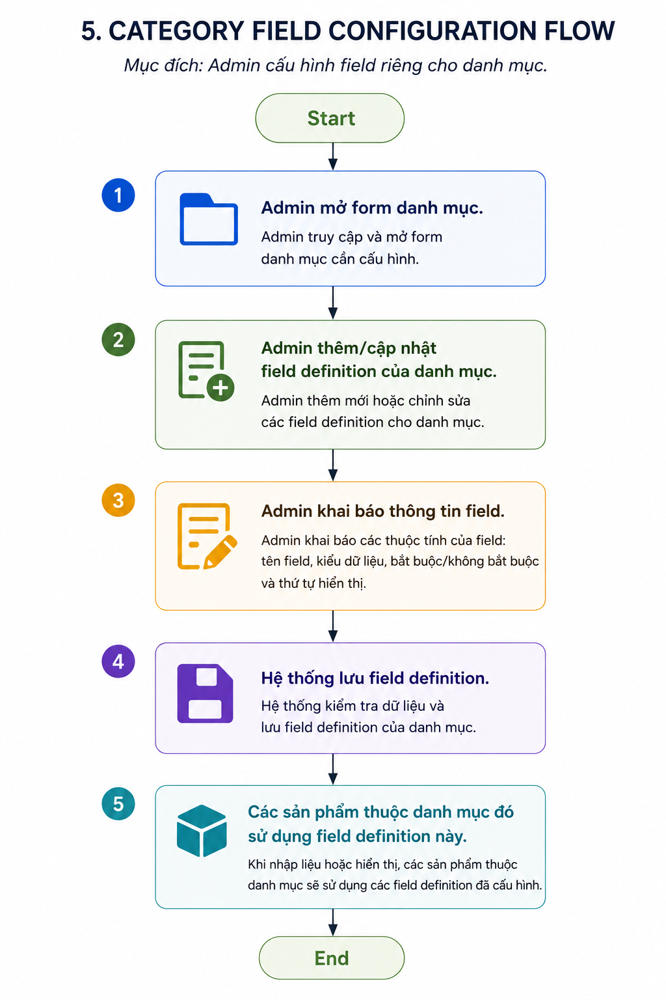

# Flows Design

| Thuộc tính | Giá trị |
|---|---|
| Dự án | Product Management PV |
| Ứng dụng | Quản lý sản phẩm nội bộ |
| Nguồn đầu vào | [Detail Technical Design](./detailed_technical_design.md) |
| Phiên bản tài liệu | Draft 1 |
| Ngày lập | 2026-08-06 |

Tài liệu này mô tả 5 flow chính trong hệ thống gồm:
- Tạo/cập nhật sản phẩm
- Xem detail sản phẩm
- Tìm/lọc sản phẩm
- So sánh sản phẩm
- Cấu hình trường trong từng danh mục

## 1. Product Creation/Update Flow

Mục đích: admin tạo/cập nhật sản phẩm:

1. Admin mở form tạo/cập nhật sản phẩm.
2. Admin nhập thông tin chung của sản phẩm.
3. Admin chọn danh mục sản phẩm.
4. Hệ thống tải danh sách field tương ứng với danh mục đã chọn.
5. Admin nhập giá trị cho các field theo danh mục.
6. Hệ thống kiểm tra dữ liệu bắt buộc và kiểu dữ liệu.
7. Hệ thống lưu Product và Product Field Values.

## 2. Product Detail View Flow

Mục đích: người dùng xem đầy đủ thông tin sản phẩm:

1. Người dùng chọn một sản phẩm từ danh sách hoặc kết quả tìm kiếm.
2. Hệ thống lấy thông tin chung của Product.
3. Hệ thống lấy Category của Product.
4. Hệ thống lấy Field Definitions của Category.
5. Hệ thống lấy Field Values của Product.
6. Hệ thống ghép Field Definitions với Field Values.
7. Hệ thống hiển thị thông tin chi tiết sản phẩm.

## 3. Product Search / Filter Flow

Mục đích: người dùng tìm sản phẩm cần tra cứu

1. Người dùng nhập từ khóa hoặc chọn điều kiện lọc.
2. Hệ thống áp dụng điều kiện tìm kiếm/lọc trên Product.
3. Nếu lọc theo field động, hệ thống truy vấn Product Field Values tương ứng.
4. Hệ thống trả về danh sách sản phẩm phù hợp.

## 4. Product Comparison Flow

Mục đích: Người dùng so sánh nhiều sản phẩm cùng danh mục.

1. Người dùng chọn nhiều sản phẩm để so sánh.
2. Hệ thống kiểm tra các sản phẩm thuộc cùng một danh mục.
3. Hệ thống lấy Field Definitions của danh mục.
4. Người dùng chọn tiêu chí so sánh.
5. Hệ thống lấy Field Values của các sản phẩm đã chọn.
6. Hệ thống hiển thị bảng so sánh theo tiêu chí đã chọn.

## 5. Category Field Configuration Flow

Mục đích: Admin cấu hình field riêng cho danh mục.
1. Admin mở form danh mục.
2. Admin thêm/cập nhật field definition của danh mục.
3. Admin khai báo tên field, kiểu dữ liệu, bắt buộc/không bắt buộc và thứ tự hiển thị.
4. Hệ thống lưu field definition.
5. Các sản phẩm thuộc danh mục đó sử dụng field definition này khi nhập liệu và hiển thị.