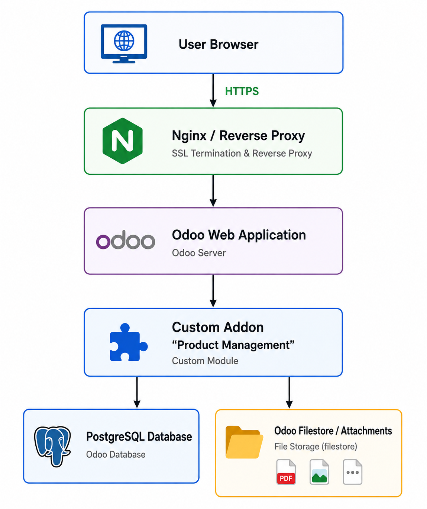

# Overal Architecture Design

| Thuộc tính | Giá trị |
|---|---|
| Dự án | Product Management PV |
| Ứng dụng | Quản lý sản phẩm nội bộ |
| Nguồn đầu vào | `functional_requirements.md`, `non_functional_requirements.md` |
| Phiên bản tài liệu | Draft 1 |
| Ngày lập | 2026-08-06 |

## 1. Nội dung tài liệu

Tài liệu này mô tả kiến trúc tổng quan cả hệ thống Product Management PV ở high-level, định hướng kỹ thuật

## 2. Kiến trúc tổng quan

Người dùng truy cập hệ thống qua trình duyệt web. Request đi qua Ngĩn và reverse proxy sau đó được xử lý bởi Odoo. Các nghiệp vụ riêng của hệ thống được triển khai trong custom addon `product_management`. Dữ liệu nghiệp vụ được lưu tại PostgreSQL, còn ảnh/tệp được lưu ở filestore của Odoo.

| Thành phần | Vai trò |
|---|---|
| Brower | Giao diện truy cập của Admin và Staff. |
| Nginx | Reverse proxy, HTTPS, điều hướng request vào Odoo.. |
| Odoo Web Application | Nền tảng chính xử lý UI, business logic, authentication và authorization. |
| Product Management Addon | Module nghiệp vụ riêng của ứng dụng. |
| PostgreSQL | Lưu dữ liệu người dùng, sản phẩm, danh mục, tồn kho và cấu hình nghiệp vụ. |
| Odoo Filestore | Lưu ảnh sản phẩm và file đính kèm.|
| Docker Compose | Quản lý môi trường chạy Odoo và PostgreSQL.|

